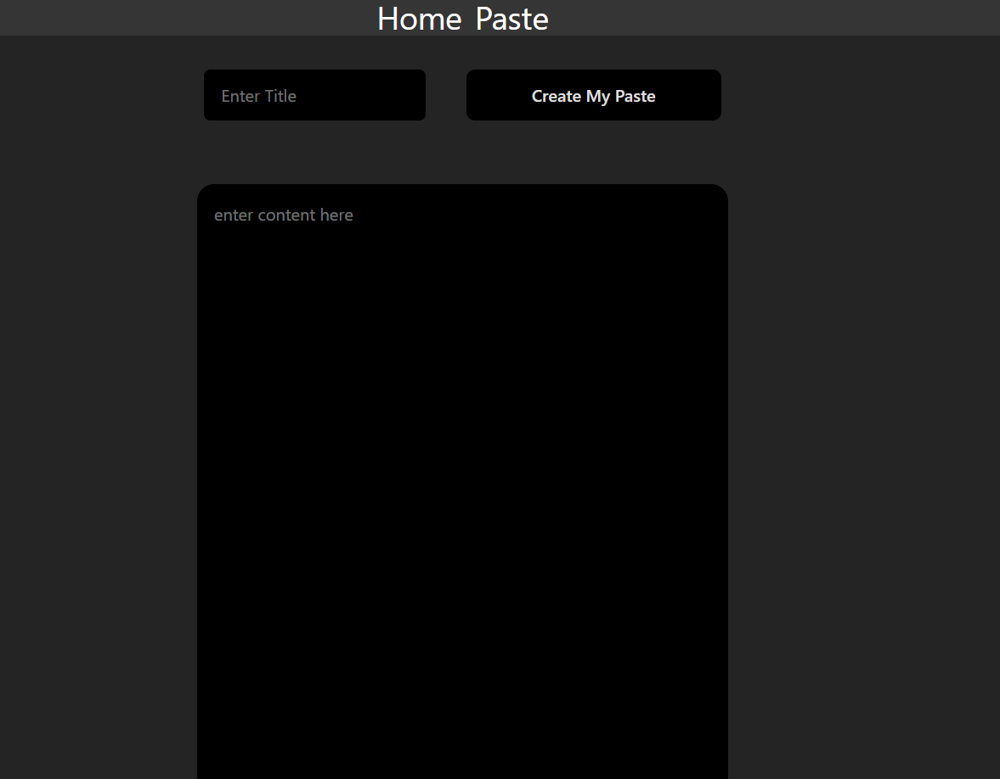
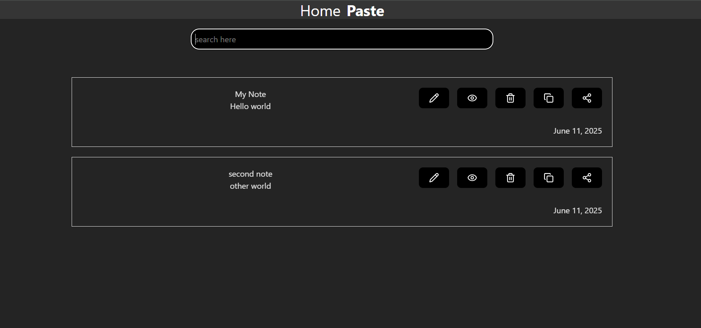

# Notes Saver

A responsive web app for saving notes with features like create, edit, delete, and search. Built using HTML, CSS, JavaScript, and deployed on Vercel.

## 🚀 Tech Stack
- HTML,
-  CSS,
-  JavaScript
-  TailwindCSS
-  React

## 🔗 Live Demo
[Live Demo](https://notes-saver-dwrd.vercel.app/)

## 📸 Screenshots

